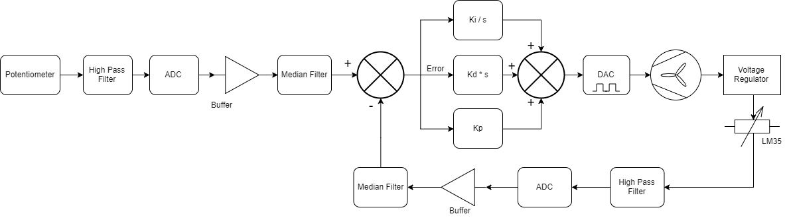

# Controls Final Project
## Overview
This system is designed to control a fan using PWM that is set by a PID controller. The overview of the system is given in the block diagram below.

## Functionality
The system maintians a desired temperature on a heating element by taking readings from a temerautre sensor and acting on them usign a PID controller. The desired temeprature is set using a potentiometer. The range for desired temepratures is set to 50-80 degrees C. The reference voltage for the potentiometer is 3.3 VDC such that 3.3 V corresponds to 50 degrees C and 0 V corresponds to 80 degrees C. The relationship is given as: desired temperature = 80 - (91 * potentiometer votlage).
## Use
The device is connected as shown below in the schematic. The desired and current temperature can be read through a serial connection using a program like RealTerm.
## Pins
 * P3.5 - PWM output from MSP430
 * P6.0 temperature sensor voltage reading
 * P6.1 potentiometer votlage reading
## Schematic

## Mini Demo
The demo video can be downloaded from this repository or viewed online at https://drive.google.com/open?id=14-AI9EcmoH4rl4chxboLBu3b_AB6IzmD

## Acknowledgements
 * Some of the basic code functionality is based on example code found on <a href="https://energia.nu/reference/en/language/functions/analog-io/analogread/">Energia's website</a>.
